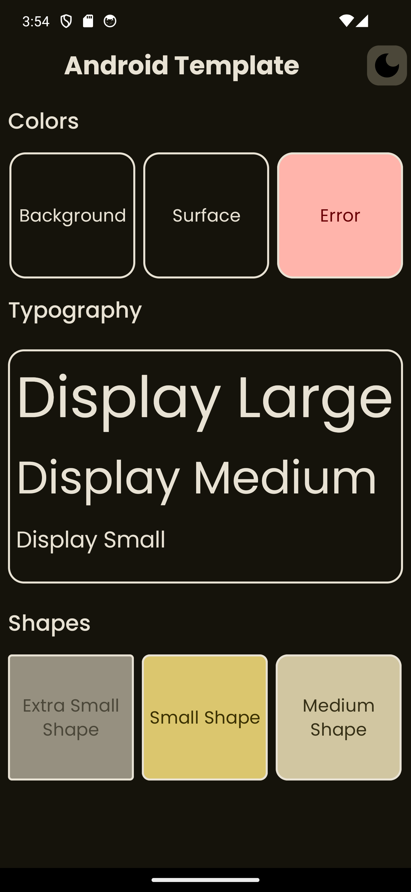
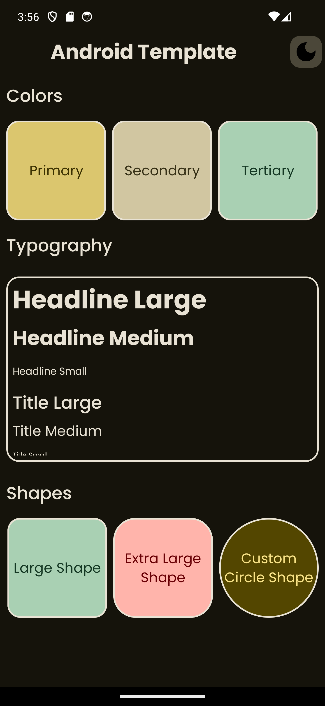
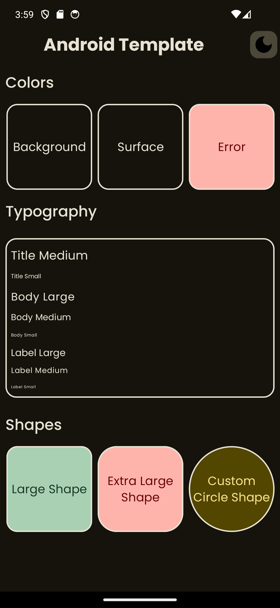
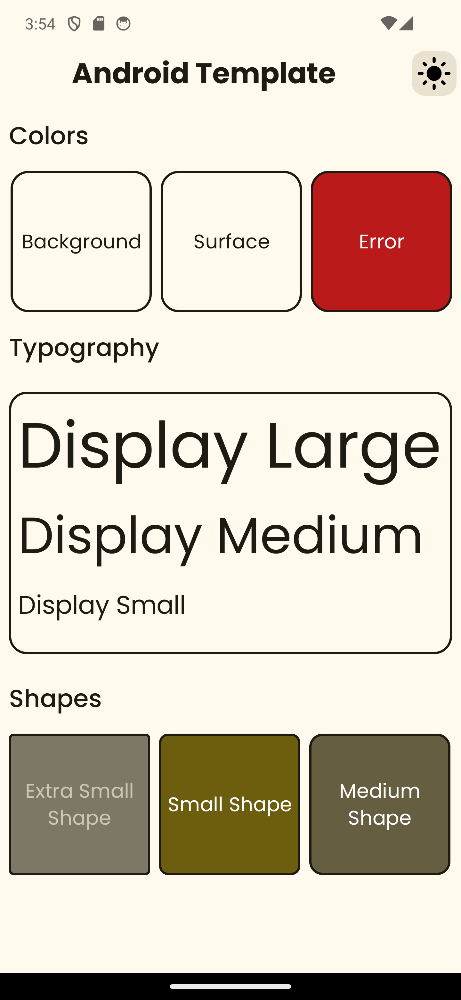
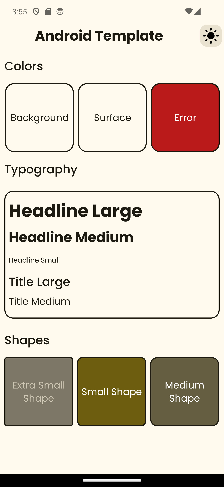
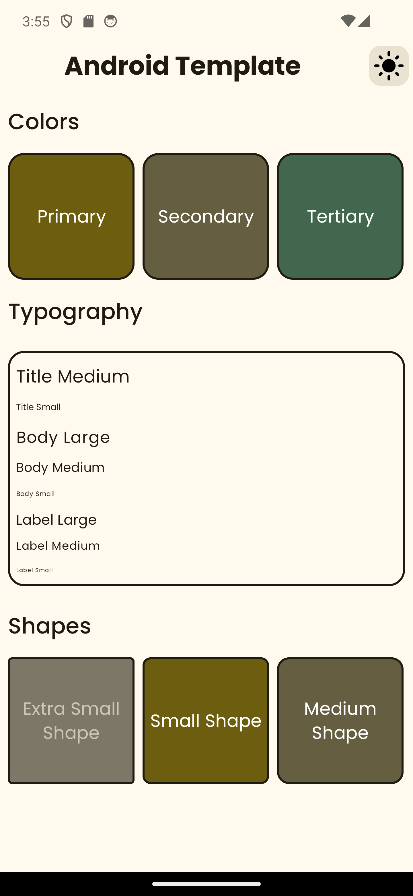

# Android Template Repo
Template repository for android

# Screenshots

Below are the screenshots of the application in dark and light themes.

| Theme     | Screenshot 1                               | Screenshot 2                                   | Screenshot 3                                   |
|-----------|--------------------------------------------|------------------------------------------------|------------------------------------------------|
| **Dark**  |    |    |    |
| **Light** |  |  |  |

# Readme is still in draft version.

# What's inside this

This is a template repo for android project, it has convention plugin to allow sharing the build config with other
modules, it also uses modern build style like using toml file for version management and etc.

# What's a convention plugin

* It's a way to share the build logic between multiple module in a multi module project

# How to add this convention plugin

* Assume your project is using kotlin DSL, otherwise please take care of the syntax
  changes https://www.codeconvert.ai/kotlin-to-groovy-converter *
  Step 1
* Create a `build-loigc` folder and create `settings.gradle.kts` and paste the below content there

```
@file:Suppress("UnstableApiUsage")

dependencyResolutionManagement {

    repositories {
        google()
        mavenCentral()
    }

    versionCatalogs {
        create("libs") {
            from(files("../gradle/libs.versions.toml"))
        }
    }
}

rootProject.name = "build-logic"
include(":convention")

```

Inside project `settings.gradle.kts` add `includeBuild("build-logic")` inside pluginManagement
Example

```
pluginManagement {

    includeBuild("build-logic")

    repositories {
        google()
        mavenCentral()
        gradlePluginPortal()
    }
}

// ...
```

Step 2
Create a `convention` module and modify the `build.gradle.kts` file inside the `convention` as below

```
plugins {
    `kotlin-dsl`
}

group = "com.droidstarter.buildlogic"

java {
    sourceCompatibility = JavaVersion.VERSION_17
    targetCompatibility = JavaVersion.VERSION_17
}

dependencies {
    compileOnly(libs.android.gradlePlugin)
    compileOnly(libs.kotlin.gradlePlugin)
}

gradlePlugin {
    plugins {
        create("androidApplicationCompose") {
            id = "com.droidstarter.convention.application.compose"
            implementationClass = "com.droidstarter.convention.AndroidApplicationComposeConventionPlugin"
        }

        // ...
    }
}
```

Ensure `libs.versions.toml` has below dependencies

```
[versions]
androidGradlePlugin = "8.0.2"
kotlin = "1.9.22"

[libraries]
android-gradlePlugin = { group = "com.android.tools.build", name = "gradle", version.ref = "androidGradlePlugin" }
kotlin-gradlePlugin = { group = "org.jetbrains.kotlin", name = "kotlin-gradle-plugin", version.ref = "kotlin" }
```

Step 3
Create your first convention plugin, lets create a android application plugin, basically most the build logic we
have inside the android 'app' module `build.gradle` will be added here, so we can use this plugin instead of
`com.android.application` and also if our project has other android application module (i.e module build .apk as
output) we can apply our plugin to avoid duplicating the build logic.

* Inside convention module create a kotlin class `AndroidApplicationConventionPlugin.kt`

```
class AndroidApplicationConventionPlugin : Plugin<Project> {
    override fun apply(target: Project) {
        with(target) {
            with(pluginManager) {
                apply("com.android.application") // The plugin we used to directly use in app module
                apply("org.jetbrains.kotlin.android") // Ensure project build.gradle declared this plugin
            }

            extensions.configure<ApplicationExtension> {
                configureKotlinAndroid(this)
                defaultConfig.targetSdk = AppConfig.targetSdk
            }
        }
    }
}
```

Our job is to make a reusable build logic, so if we are going to create a reusable app module build logic, lets
start with applying the "com.android.application" plugin.
Ensure both "com.android.application" and "org.jetbrains.kotlin.android" declared in project build.gradle

Now with the help of kotlin DSL we configure the app module build config like, minSdk, targetSdk, default set of
dependencies etc. Take a look at `configureKotlinAndroid` method
inside [KotlinAndroid.kt](build-logic%2Fconvention%2Fsrc%2Fmain%2Fkotlin%2Fcom%2Fdroidstarter%2Fsupport%2FKotlinAndroid.kt)

Step 4
Lets register our convention plugin now, so that we can use it inside the app module `build.gradle.kts`

Inside convention module `build.gradle.kts` inside `gradlePlugin` section lets add our plugin info like below

```
gradlePlugin {
    plugins {
        create("androidApplication") {
            id = "com.droidstarter.convention.application"
            implementationClass = "com.droidstarter.convention.AndroidApplicationConventionPlugin"
        }
    }
}
```

Lets map the `AndroidApplicationConventionPlugin.kt` class to a unique id `com.droidstarter.convention.application`
and give a unique name to this new plugin as `androidApplication`

Step 5
Lets go to our application module `build.gradle.kts` and replace this new plugin id with the old
`com.android.application`, like below

```

plugins {
    - id("com.android.application") // Remove
    + id("com.droidstarter.convention.application") // Replace with this one
}
```

Now we can remove the minSdk, targetSdk declaration from this module, since those are already covered by our
`androidApplication` plugin.

Step 6 (Optional)
Instead of hardcoding the id inside the `build.gradle.kts` we can make use of toml file to resolve this plugin.

Inside `libs.versions.toml` file lets add plugin section like below

```
[plugins]
# Plugins defined by this project`
droidstarter-android-application = { id = "com.droidstarter.convention.application", version = "unspecified" }

```

Now lets go to our application module `build.gradle.kts` and resolve the plugin using toml (gradle version catalog),
like below

```

plugins {
    - id("com.android.application")
    - id("com.droidstarter.convention.application")
    + alias(libs.plugins.droidstarter.android.application)
}
```

# Create new module (Example design system)

Docs coming soon